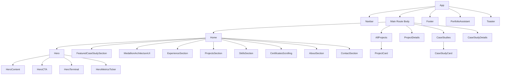

# Component Hierarchy Diagram

```mermaid
flowchart TD
    A[App] --> B[Navbar]
    A --> C[Main Route Body]
    A --> D[Footer]
    A --> E[PortfolioAssistant]
    A --> F[Toaster]

    C --> H[Home]
    H --> H1[Hero]
    H --> H2[FeaturedCaseStudySection]
    H --> H3[MedallionArchitectureUI]
    H --> H4[ExperienceSection]
    H --> H5[ProjectsSection]
    H --> H6[SkillsSection]
    H --> H7[CertificatesScrolling]
    H --> H8[AboutSection]
    H --> H9[ContactSection]

    H1 --> HT1[HeroContent]
    H1 --> HT2[HeroCTA]
    H1 --> HT3[HeroTerminal]
    H1 --> HT4[HeroMetricsTicker]

    C --> P[AllProjects]
    P --> PC[ProjectCard]
    C --> PD[ProjectDetails]
    C --> CS[CaseStudies]
    CS --> CSC[CaseStudyCard]
    C --> CSD[CaseStudyDetails]
```
