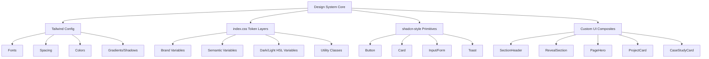

# Design System Architecture Diagram

```mermaid
flowchart TD
    A[Design System Core] --> B[Tailwind Config]
    A --> C[index.css Token Layers]
    A --> D[shadcn-style Primitives]
    A --> E[Custom UI Composites]

    B --> B1[Fonts]
    B --> B2[Spacing]
    B --> B3[Colors]
    B --> B4[Gradients/Shadows]

    C --> C1[Brand Variables]
    C --> C2[Semantic Variables]
    C --> C3[Dark/Light HSL Variables]
    C --> C4[Utility Classes]

    D --> D1[Button]
    D --> D2[Card]
    D --> D3[Input/Form]
    D --> D4[Toast]

    E --> E1[SectionHeader]
    E --> E2[RevealSection]
    E --> E3[PageHero]
    E --> E4[ProjectCard]
    E --> E5[CaseStudyCard]
```
