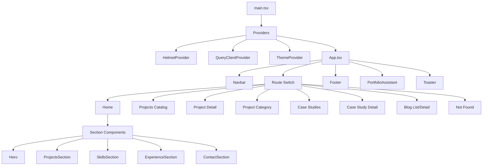

# Frontend Architecture Diagram

```mermaid
flowchart TD
    A[main.tsx] --> B[Providers]
    B --> B1[HelmetProvider]
    B --> B2[QueryClientProvider]
    B --> B3[ThemeProvider]
    B --> C[App.tsx]

    C --> D[Navbar]
    C --> E[Route Switch]
    C --> F[Footer]
    C --> G[PortfolioAssistant]
    C --> H[Toaster]

    E --> P1[Home]
    E --> P2[Projects Catalog]
    E --> P3[Project Detail]
    E --> P4[Project Category]
    E --> P5[Case Studies]
    E --> P6[Case Study Detail]
    E --> P7[Blog List/Detail]
    E --> P8[Not Found]

    P1 --> S1[Section Components]
    S1 --> S2[Hero]
    S1 --> S3[ProjectsSection]
    S1 --> S4[SkillsSection]
    S1 --> S5[ExperienceSection]
    S1 --> S6[ContactSection]
```
