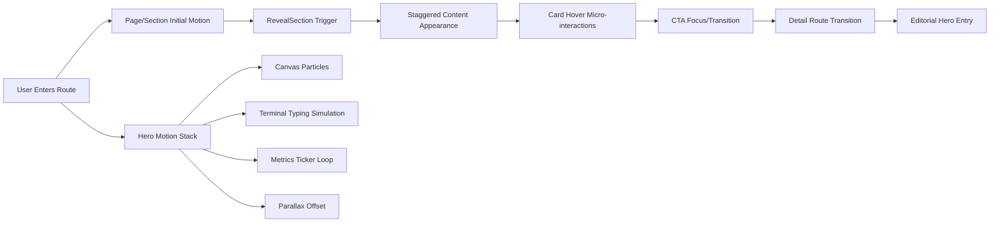

# Motion Interaction Flow Diagram

```mermaid
flowchart LR
    A[User Enters Route] --> B[Page/Section Initial Motion]
    B --> C[RevealSection Trigger]
    C --> D[Staggered Content Appearance]
    D --> E[Card Hover Micro-interactions]
    E --> F[CTA Focus/Transition]

    A --> G[Hero Motion Stack]
    G --> G1[Canvas Particles]
    G --> G2[Terminal Typing Simulation]
    G --> G3[Metrics Ticker Loop]
    G --> G4[Parallax Offset]

    F --> H[Detail Route Transition]
    H --> I[Editorial Hero Entry]
```
