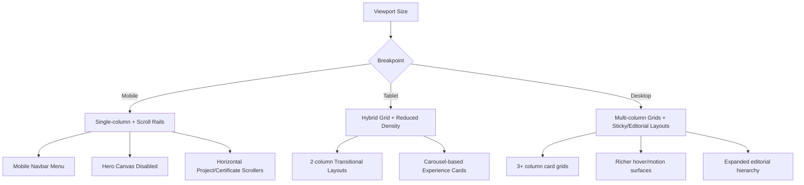

# Responsive Architecture Diagram

```mermaid
flowchart TD
    A[Viewport Size] --> B{Breakpoint}
    B -->|Mobile| C[Single-column + Scroll Rails]
    B -->|Tablet| D[Hybrid Grid + Reduced Density]
    B -->|Desktop| E[Multi-column Grids + Sticky/Editorial Layouts]

    C --> C1[Mobile Navbar Menu]
    C --> C2[Hero Canvas Disabled]
    C --> C3[Horizontal Project/Certificate Scrollers]

    D --> D1[2-column Transitional Layouts]
    D --> D2[Carousel-based Experience Cards]

    E --> E1[3+ column card grids]
    E --> E2[Richer hover/motion surfaces]
    E --> E3[Expanded editorial hierarchy]
```
