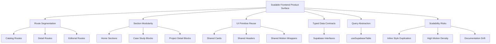

# Scalability Architecture Diagram

```mermaid
flowchart TD
    A[Scalable Frontend Product Surface] --> B[Route Segmentation]
    A --> C[Section Modularity]
    A --> D[UI Primitive Reuse]
    A --> E[Typed Data Contracts]
    A --> F[Query Abstraction]

    B --> B1[Catalog Routes]
    B --> B2[Detail Routes]
    B --> B3[Editorial Routes]

    C --> C1[Home Sections]
    C --> C2[Case Study Blocks]
    C --> C3[Project Detail Blocks]

    D --> D1[Shared Cards]
    D --> D2[Shared Headers]
    D --> D3[Shared Motion Wrappers]

    E --> E1[Supabase Interfaces]
    F --> F1[useSupabaseTable]

    A --> G[Scalability Risks]
    G --> G1[Inline Style Duplication]
    G --> G2[High Motion Density]
    G --> G3[Documentation Drift]
```
